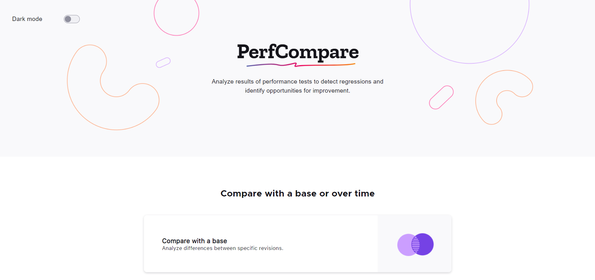

# PerfCompare

[](https://circleci.com/gh/mozilla/perfcompare/tree/master)
[](https://codecov.io/gh/mozilla/perfcompare)


Performance Comparison Tool



## Setup

### Requirements

- [nodejs](https://nodejs.org/en/download/)

### Installation

```
# Clone the repo
git clone https://github.com/mozilla/perfcompare.git
cd perfcompare

# Install node modules
npm install

# Runs on localhost:3000 by default
npm run start-dev
```

### Contributing

We welcome contributions to our project.

If you find an issue that you'd like to work on that is not assigned to anyone, leave a comment on the issue and request that it be assigned to you.

If you do not receive a response within 2-3 days, you can follow up in the #PerfCompare matrix channel.

After addressing the issue, ensure both tests and linting pass before submitting a pull request.

When submitting a pull request, please mention the issue number to link the pull request and issue to one another. You can do this by typing # following immediately by the issue number, i.e., `#123`

Submit your pull request to the `staging` branch. `staging` is merged to master weekly on Monday.

We recommend the following workflow to contribute to PerfCompare:

1. [Set an upstream remote](https://docs.github.com/en/get-started/getting-started-with-git/managing-remote-repositories/) that points to the project [repository](https://github.com/mozilla/perfcompare.git), and an 'origin' remote that points to your fork.
2. To keep your fork up-to-date, use `git rebase upstream` rather than merging. This causes fewer merge conflicts and keeps the git history cleaner.

```
# Git commands for keeping your branch up to date with the lastest master
git fetch upstream
git rebase upstream/master
git push --force origin <local branch>
```

### Validating JavaScript

We run our JavaScript code in the frontend through [ESLint](https://eslint.org/) to ensure that new code has a consistent style and doesn't suffer from common errors.

```
# To run ESLint by itself, you may run the lint task:
npm run lint

# Automatically fix linting issues found (where possible):
npm run lint:fix

# Checking formatting issues with Prettier:
npm run format:check

# Automatically fix format issues found (where possible):
npm run format
```

### Running Tests

Tests can be run with the following commands:

```
npm run test

# Run tests and watch for changes
npm run test:watch

# Run tests with coverage
npm run test:coverage
```

#### Snapshot Tests

When making changes to the UI, snapshots should also be updated to match. Snapshot tests
ensure no UI changes occur unexpectedly.

After manually verifying the UI renders as intended, run the following command to update
snapshots:
`jest --updateSnapshot`

Snapshot files should be included in your pull request(s).
